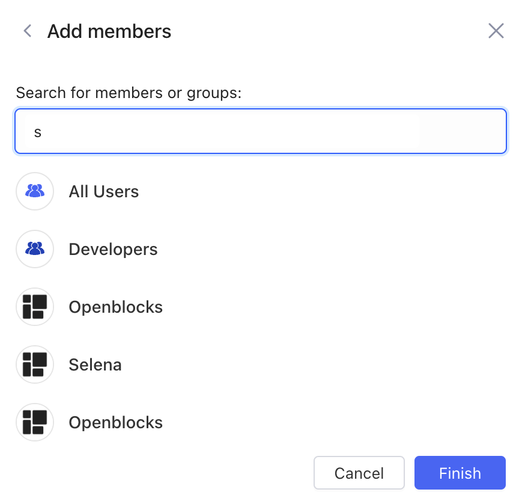
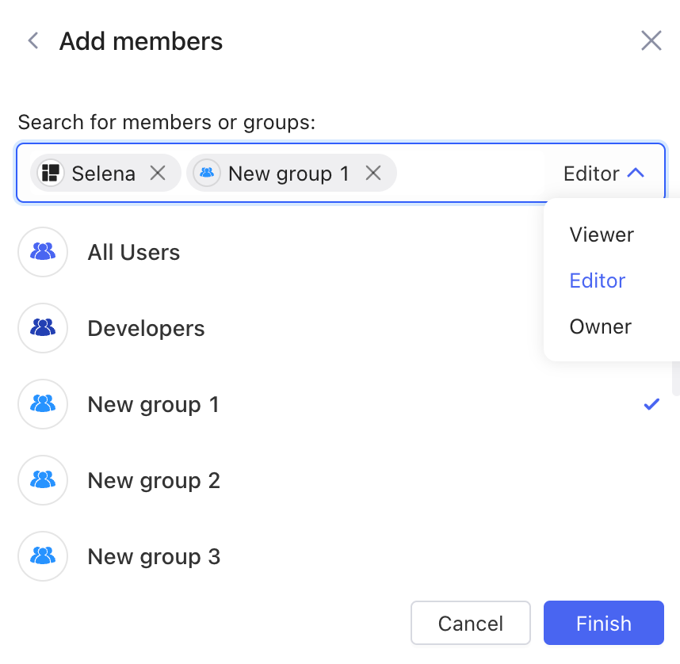

# Permissions for resources

Openblocks implements [Role-based Access Control](https://en.wikipedia.org/wiki/Role-based\_access\_control) (RBAC) by assigning a set of permissions to different roles. These permissions determine the actions users can take on resources, including apps, modules, queries, data sources and folders.&#x20;

Only workspace admins and members of Developers group are allowed to create resources. For workspace admins, they are in fact the owner of all resources.

## Apps and modules

### Share and set roles

App owners can add members to app and assign different roles to them. In a web app or module editor, click **Share** at the top right, then click **Add members**.

<figure><figcaption></figcaption></figure>

Choose members and groups in the list and set roles for them.

The available roles and their corresponding permissions are listed in the table below.

| Role                     | Permissions                                                                                                                  |
| ------------------------ | ---------------------------------------------------------------------------------------------------------------------------- |
| <ul><li>Viewer</li></ul> | <ul><li>View the app, or use the module</li></ul>                                                                            |
| <ul><li>Editor</li></ul> | <ul><li>View the app, or use the module</li><li>Rename</li><li>Edit</li><li>Release</li><li>Export</li></ul>                 |
| <ul><li>Owner</li></ul>  | <ul><li>All permissions of <strong></strong> Editor</li><li>Delete the app or module</li><li>Set roles for members</li></ul> |

### Make app public

If you want to make an app public and accessible to all users (including anonymous users), you can toggle the **Make the app public** switch in **Share** settings.

.png>)

## Data sources

In Openblocks, members with permissions to use, edit and delete data sources **** are listed as follows:

* **Edit** or **Delete**
  * Data source creators and workspace admins.
* **Use**
  * Workspace admins and developers.
  * Members with permissions to edit an app are automatically granted access to use data sources already used in the app.
